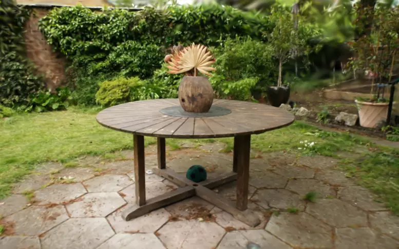
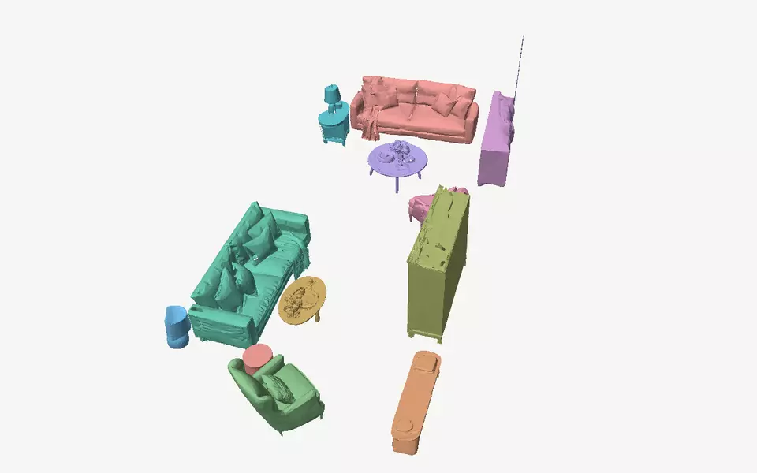
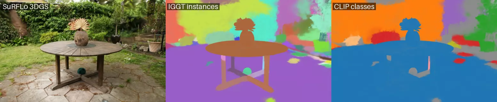

<h1 align="center">GS_playground</h1>

<p align="center">
Recent Gaussian-splatting and feed-forward 3D methods, run end to end on public data, each with something to look at.
</p>

<table>
<tr>
<td width="50%"><a href="experiments/surflo/README.md"></a></td>
<td width="50%"><a href="experiments/worldsculpt/README.md"></a></td>
</tr>
<tr>
<td align="center"><sub><a href="experiments/surflo/README.md"><b>SuRFLo</b></a>: 16 unposed photos of Mip-NeRF 360 garden in, 3D Gaussians out, flown between two of its input cameras</sub></td>
<td align="center"><sub><a href="experiments/worldsculpt/README.md"><b>WorldSculpt</b></a>: the authors' released Marble living room, 13 objects each completed as a mesh from posed frames, per-object masks and 3D boxes (the release's own, predicted by SAM3 tracking, not annotated)</sub></td>
</tr>
</table>

<p align="center"><a href="experiments/iggt/README.md"></a><br><sub><a href="experiments/iggt/README.md"><b>IGGT on SuRFLo</b></a>: the 3D Gaussians, their instance groups, and CLIP's class names (exploratory; the ground is named "table", see its README)</sub></p>

Each method here is pinned to its upstream commit, patched only where it had to be, run on public benchmark scenes or the authors' own data, and given a demo a person can open.
Each project's README has the details: what it does, what we added, the numbers with their source files, and where it falls short.

## Projects

| project | what it shows |
|---|---|
| [**SuRFLo**](experiments/surflo/README.md) (NeurIPS 2026) | unposed photos to a mesh and 3D Gaussians, 16 of them in about two minutes on one GPU; our 3DGS export, and its cost and novel-view quality against a per-scene 3DGS on Mip-NeRF 360 garden |
| [**IGGT on SuRFLo**](experiments/iggt/README.md) (ICLR 2026) | instance groups and class names on SuRFLo's Gaussians from one shared encoding (exploratory), and whether VGGT and IGGT degrade with more frames than they were trained on |
| [**WorldSculpt**](experiments/worldsculpt/README.md) | every object in a scene completed as its own mesh from posed frames, per-object masks and 3D boxes, on the authors' released Marble living room (13 objects); and a silent sparse-convolution failure we found and fixed |

## Running it

```bash
bash tools/setup/clone_upstream.sh      # pinned upstream clones, patched
bash tools/setup/puffin_world_env.sh    # base env: python 3.10, torch 2.7, cu126
bash tools/setup/surflo_env.sh          # SuRFLo and IGGT
bash tools/setup/worldsculpt_env.sh     # WorldSculpt, on the base env
```

- Each method's README in [`experiments/`](experiments/) gives its weights, its runners and the traps we hit.
- Runners read machine-local data roots (`GS_PLAYGROUND_DATA`, `GS_PLAYGROUND_SCANNETPP`, `MIPNERF360_GARDEN`, ...) from an untracked `.env.local`, which the activation scripts source.
- Mip-NeRF 360 comes from [`tools/fetch/fetch_mipnerf360.sh`](tools/fetch/fetch_mipnerf360.sh); ScanNet++ needs its own licence.
- The web viewers (Spark and three.js) and the clips are built locally from runs; [`results/DEMOS.md`](results/DEMOS.md) lists each with its builder, and [`tools/build_readme_media.sh`](tools/build_readme_media.sh) makes the clips.

## How results are kept

- A run that settles a question is pre-registered first: its metric and decision rule are committed before it starts (`experiments/<method>/PREREG_E##.md`), later changes are dated amendments that say what had already been seen, and post-hoc arms are labelled post hoc.
- A run that only explores is labelled exploratory where its result is shown.
- Runners write the numbers they report to `results/<method>/` and stamp their output directory with this repository's and the upstream's commit and diff, the host, GPU and command.
- The lab notebook these runs were logged in stays private; the method READMEs, pre-registrations and `results/` carry most of what it settled.

| where | what |
|---|---|
| [`experiments/<method>/`](experiments/) | one directory per method, named after its paper; `run_E##_<slug>.sh` is a runner |
| [`src/gs_playground/`](src/gs_playground/) | the library: one package per method, plus shared Gaussian I/O and rendering, the web viewer, and the README media builder |
| [`results/`](results/) | the numbers each runner writes, per method |
| [`third_party/`](third_party/) | `PINS.tsv` (upstream commits) and `patches/` (each with its reason); clones are rebuilt, not vendored |
| [`docs/media/`](docs/media/) | the clips and stills the READMEs show |

All of it ran on one RTX 6000 Ada (48 GB).

## Licence

This repository's own code is under the [Apache License 2.0](LICENSE).
Upstream code and weights keep their own licences, listed in [`third_party/README.md`](third_party/README.md), including the non-commercial terms on SuRFLo's and IGGT's weights.
