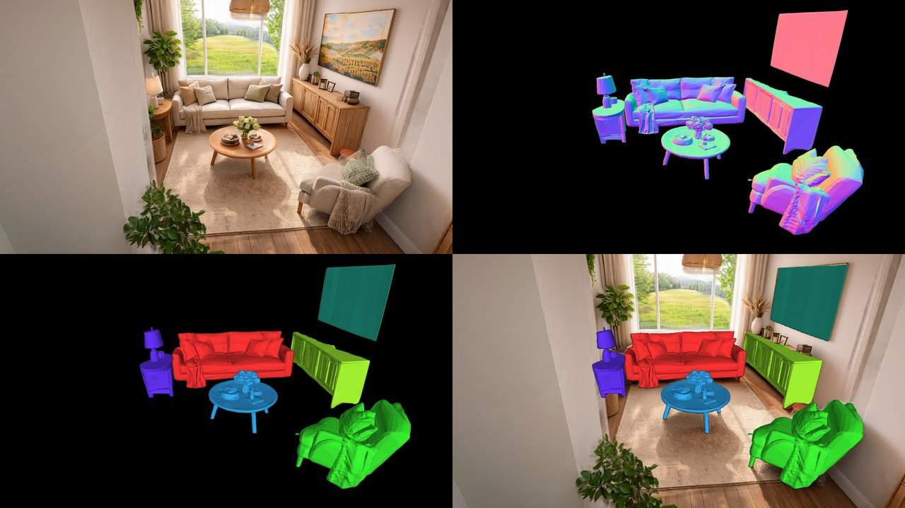

# WorldSculpt

WorldSculpt, arXiv 2609.05416: a LoRA over the Pixal3D base that completes every object in a scene as a whole mesh, from posed frames, a mask per object in each frame, and a 3D box per object.
Code [`AlayaLab/WorldSculpt`](https://github.com/AlayaLab/WorldSculpt), pinned in `third_party/PINS.tsv`; weights HF `AlayaLab/WorldSculpt`.
Run here on the authors' Marble scene (E08c, the reproduction arm), and rerun after the fault below (E08g).

## Results: the authors' Marble scene (E08c, E08g)

<p align="center"></p>

The 13 meshes of the rerun (E08g), turned once: the decimated meshes from the E08g scene viewer (at most 60,000 faces per object), one flat colour per object, Lambert-shaded from a light that follows the camera.
There is no floor, wall or ceiling because WorldSculpt was given objects only.

<p align="center"></p>

WorldSculpt's own render of view 2 of 24, unedited apart from arranging its four panels 2x2: the input frame, the meshes' normals, one colour per object, and that colour laid over the frame.
It shows six of the 13 objects; the rest stand at the other end of the room.
Both are built by `python -m gs_playground.readme_media worldsculpt`.

On one scene of the authors' released Marble data, a living room with 24 posed frames and 13 objects (masks predicted by SAM3 tracking and boxes estimated from them, not annotated), every object comes out as its own mesh, placed against the frame it came from: the couches with their cushions, the armchair, lamps, the coffee table with plates and flowers, the sideboard and the bench.
The room's walls, floor, ceiling and windows are absent, because nothing in the method makes them: it completes the objects it is given, and a room's shell is not one of them.
This is one scene at one seed, geometry only, and no mesh was scored against anything.

**A silent failure, found and fixed:** our base environment's sparse-convolution backend left the shape decoder's convolutions at random weights without a warning, and every mesh came out as plausible-looking dust; see [Traps](#traps).

## Running it

```bash
bash tools/setup/worldsculpt_env.sh     # an overlay on the base env
hf download AlayaLab/WorldSculpt --local-dir data/models/worldsculpt
bash experiments/worldsculpt/run_E08c_worldsculpt.sh
```

## What it consumes

A scene directory with `transforms.json` and the frames and masks it names.
Upstream reads, per `prepare_crops_scene.py`: one global intrinsics (`fl_x`, `fl_y`, `cx`, `cy`, `w`, `h`), `frames[]` with `file_path` and an OpenGL camera-to-world `transform_matrix`, and `instances[]` with `pass_index` and `aabb_world`.
Masks are found by convention at `masks/objNN/NNNN.png` (NN the pass index, NNNN the frame's position in `frames`), grayscale, thresholded at >127; depth is never read.
An object with no usable mask frame is dropped without an error.

## Building its inputs

Upstream leaves recovering the masks and boxes out of scope.
`gs_playground.worldsculpt.ground` builds that directory for a scene that already has COLMAP poses, a trained 3DGS and instance label maps associated across views:

- `propose` back-projects every label through depth rendered from the 3DGS into a 3D box, filters the candidates with a reason for every rejection, and writes a review page for picking the objects to keep;
- `build` writes the WorldSculpt scene directory from the reviewed selection;
- `check` counts how many of the declared objects survive each upstream stage.

## Traps

**The sparse-conv backend must be `flex_gemm`** (log entry E08g).
Our base activation exported `SPARSE_CONV_BACKEND=spconv` for older TRELLIS work, and the first WorldSculpt runs inherited it; upstream's default is `flex_gemm`.
Under spconv the sparse convs in the vendored `pixal3d` name their parameters `conv.weight` and `conv.bias`, the checkpoint stores `weight` and `bias`, and `pixal3d` loads its decoders with `strict=False`.
So the shape decoder loads with 80 of its 292 parameter tensors (the weights and biases of all 40 sparse convs) left at random initialisation, without a warning.
The output is plausible-looking dust: on the authors' scene, a table decoded into 165,250 faces whose largest connected piece held under 0.1% of them (about 15,000 closed blobs), against 4,444,904 faces and 96% under flex_gemm, from the same crops and seed.
The sparse-structure stage is unaffected, so boxes and placement look right while every mesh is wrong.
The runners now export `SPARSE_CONV_BACKEND=flex_gemm` after the base activation, and the preflight fails if it is missing.
With it, two runs at one seed give bitwise-identical vertices for all 13 objects of the authors' scene.

**Upstream resumes from whatever meshes are on disk**, so a changed selection or backend needs a fresh output directory.
